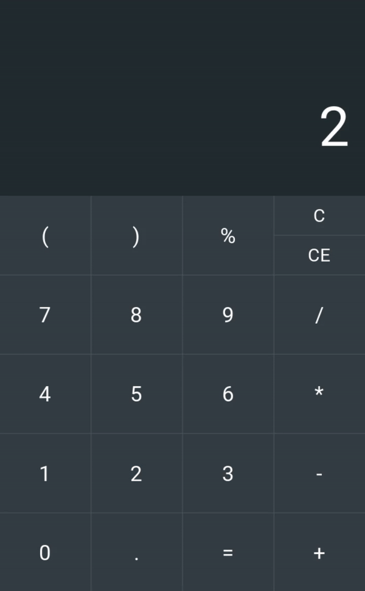

# Calculator

The simple [Calculator](https://en.m.wikipedia.org/wiki/Calculator) in Python and Kivy.

### Bugs
- possibility to enter two or more operators
- after the "=" operator calculates, the result is not reset and you need to reset it manually